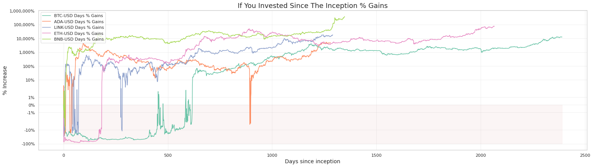
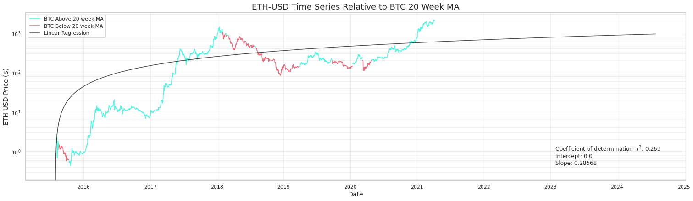
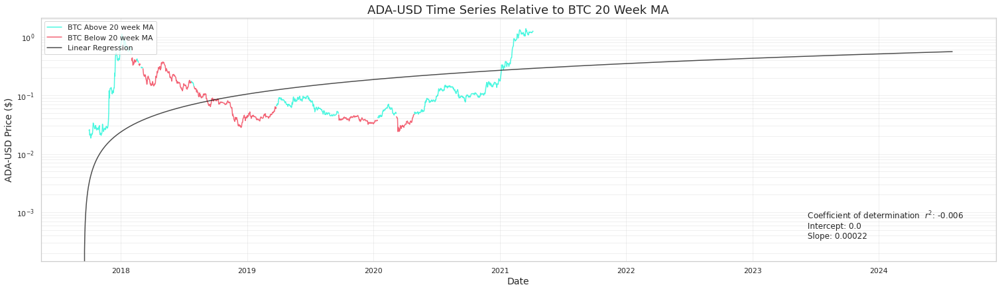
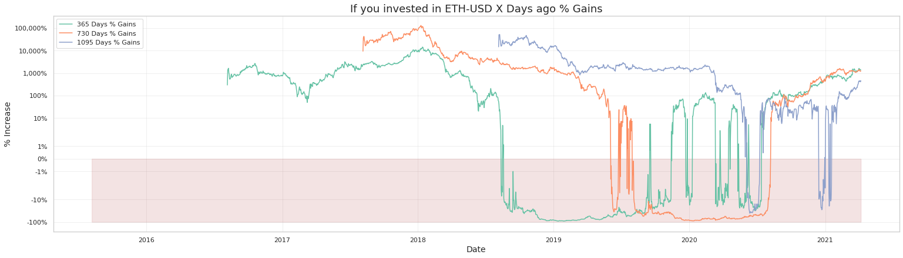
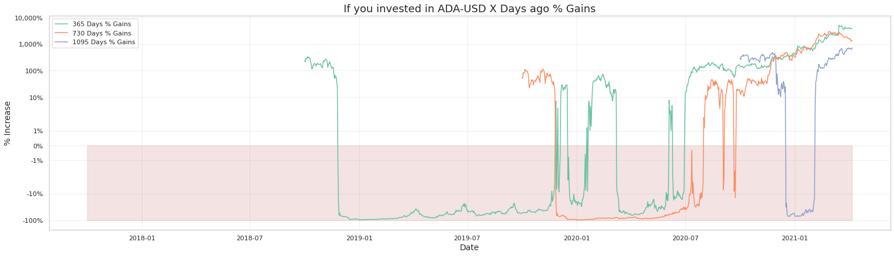
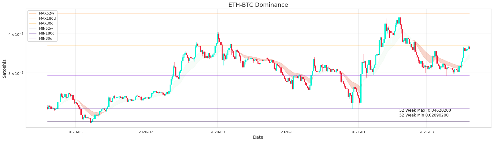
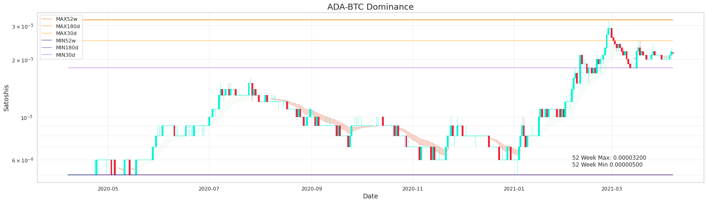

# Cryptocurrency Trading Analysis
 Observations using historical data of cryptocurrencies. 

 *Disclaimer: This is not financial advice*

  

In the following notebook observes trends in altcoins using graphs. 

Examples using **ETH** and **ADA** are shown below. 

A time-series with a linear regression trend line + BTC 20 week Moving Average colour coded. 

  
   

The % gain if you had held for 1,2 and 3 years ago to that date 

  
   

The price relative to **BTC** and its recently minimum and maximum prices.

  
   

